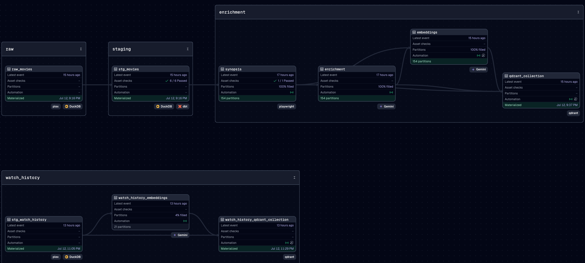

# plex-ingest

Dagster-based data pipeline for `plex-rag`: polling Plex, scraping
synopses, generating LLM enrichments, and embedding everything into a
Qdrant vector store. This repo owns all writes to Qdrant; `plex-rag` is a
read-only consumer of the collection this pipeline produces.

## Purpose

`plex-rag` is a chatbot that gives conversational movie recommendations drawn
only from a user's own Plex library — but a chat app can't answer "something
moody and Kubrick-esque" or "what fits tonight" by querying Plex directly:
Plex only knows titles, genres, and cast, not tone, subgenre, or critical
vocabulary. `plex-ingest` is the offline half of that project — it exists to
turn a raw Plex library into a knowledge base rich enough to support that kind
of question.

For every movie in the library, this pipeline:

1. **Resolves a stable identity** — Plex's own IDs aren't reliable long-term
   keys, so each movie is matched to its IMDb ID and dropped if no match
   exists.
2. **Scrapes a synopsis** — plot-level text, for queries that are actually
   about plot.
3. **Generates an LLM "expert enrichment" profile** — a critic-style
   breakdown (craft / meaning / context: things like directorial style,
   cinematography, themes, tone, cultural context) that a synopsis alone
   doesn't capture. This is what lets the recommender match taste- and
   vibe-based requests, not just plot keywords.
4. **Embeds both** the synopsis and the enrichment sections and writes them
   into Qdrant's `media_items` collection — the shared artifact this
   pipeline produces, and the only thing `plex-rag`'s main recommender
   reads. See [docs/vector-store-contract.md](docs/vector-store-contract.md)
   for the exact payload shape.

A second, separate pipeline (below) feeds `plex-rag`'s diversity
recommender — a mode that suggests movies farthest from a
recency-weighted embedding of the user's watch history, rather than
nearest-neighbor similarity. It resolves Plex watch history to IMDb IDs
via Plex's Discover API, embeds a short Plex-provided summary per movie
(tested sufficient — see `docs/pipeline-design.md`), and writes into its
own `watch_history` Qdrant collection, kept separate from `media_items`
because it has a different lifecycle (add-only, relevance enforced at
query time) and a different source (watch history, not the unwatched
catalog).

Because a personal library changes over time (movies get added or removed),
the pipeline is built as an incremental Dagster asset graph rather than a
one-off script: it's partitioned per movie (by IMDb ID) so only what changed
needs reprocessing, and a sensor keeps that partition set — and the deletion
of movies no longer in Plex — in sync automatically. See
`docs/pipeline-design.md` for the architectural decisions behind this asset
graph, and `CLAUDE.md` for engineering standards and how the two repos
relate.

## Pipeline

Runs against the full library end to end, verified against the real
Plex/Gemini/Qdrant stack.



- `raw_movies` — full overwrite of the Plex movie library into DuckDB on
  every run (`src/plex_ingest/defs/assets/raw_movies.py`).
- `stg_movies` — a dbt model (`dbt_project/models/staging/stg_movies.sql`)
  that resolves `imdb_id` out of Plex's raw `guids` list and drops items
  with no IMDb match, with `not_null`/`unique` tests on `imdb_id` and
  `rating_key`.
- `synopsis`, `enrichment`, `embeddings` — partitioned by `imdb_id`
  (`src/plex_ingest/defs/assets/{synopsis,enrichment,embeddings}.py`).
  `synopsis`/`enrichment` carry no `automation_condition` — the
  `sync_imdb_id_partitions` sensor is their sole trigger, based on on-disk
  file presence (see CLAUDE.md's "Environment gotchas" for why).
  `embeddings` keeps `eager()` for its steady-state cascade, and embeds the
  synopsis document *and* every enrichment section (up to 4 points per
  movie), matching `vector-store-contract.md`. `enrichment` hard-fails
  immediately (not a silent retry loop) if Gemini's *daily* free-tier quota
  is exhausted — see `gemini_enrichment.py`'s `KNOWN_RPM_LIMIT` /
  `DailyQuotaExhaustedError` if the configured model ever changes.
- `qdrant_collection` — final, unpartitioned full delete+reinsert of the
  Qdrant collection from every `data/embeddings/*.json` on disk, attaching
  full catalog metadata read fresh from `stg_movies` at rebuild time
  (`src/plex_ingest/defs/assets/qdrant_collection.py`).
- `sync_imdb_id_partitions` — sensor keeping the `imdb_id` dynamic
  partition set in sync with `stg_movies`, including a deletion cascade for
  movies no longer in Plex (`src/plex_ingest/defs/sensors/`).
- `poll_plex_job` — schedule that materializes `raw_movies` → `stg_movies`
  → `stg_watch_history` daily at 1am UTC
  (`src/plex_ingest/defs/schedules/poll_plex_daily.py`). This is what keeps
  the pipeline's entry-point assets fresh day to day; everything downstream
  of them still runs via the sensors/`eager()` cascade described above and
  below. For an immediate first materialization rather than waiting for the
  next 1am tick, see "Getting started"/"Running the pipeline end-to-end".
- `synopsis_matches_movie` — a **data-quality asset check**
  (`src/plex_ingest/defs/checks/synopsis_match.py`), distinct from the
  `tests/` code tests, that verifies a scraped synopsis actually describes
  its movie rather than an unrelated one, using an LLM judge (Groq's
  `qwen/qwen3-32b`). **Currently disabled** — `sync_imdb_id_partitions`
  passes `asset_check_keys=[]` on every `RunRequest`, so it never actually
  runs. A full-catalog verification run showed the judge is unreliable at
  scale (~85% false-mismatch rate, including contradictory verdicts for the
  same partition across runs) — the code is left in place, not deleted,
  pending a judge model with real search/grounding capability. See
  `docs/pipeline-design.md`'s "Data-quality checks" for the full design,
  the failure writeup, and what re-enabling this needs.

See CLAUDE.md's "Environment gotchas" for automation-reliability quirks
found along the way (sensor default-status handling, the
`on_missing()`/`eager()` cold-start gap, backfill-request dedup, Gemini
daily-quota handling) — that's operational tribal knowledge, not this
file's job to duplicate.

### Watch-history pipeline (diversity recommender)

A separate `watch_history` asset group, mirroring the shape of the
pipeline above but feeding its own Qdrant collection:

- `stg_watch_history` — fetches the last 60 days of Plex watch history and
  resolves each title to an `imdb_id`/genres/rating/short summary via
  Plex's Discover API (`src/plex_ingest/defs/assets/stg_watch_history.py`,
  using `PlexWatchHistoryResource`). Deliberately unpartitioned and
  upserts into an accumulating DuckDB table rather than overwriting, so a
  row survives after it ages out of the fetch window. Covered by the same
  `poll_plex_job` daily schedule as `raw_movies`/`stg_movies` (see above).
- `watch_history_embeddings` — partitioned by `watch_history_imdb_id`
  (a separate, add-only partition set from `imdb_id`); embeds one
  synopsis-shaped document per movie, no synopsis/enrichment split
  (`src/plex_ingest/defs/assets/watch_history_embeddings.py`). Pooled at
  the same `gemini_embeddings` limit as `embeddings`.
- `watch_history_qdrant_collection` — full delete+reinsert of the
  `watch_history` collection from every cached embedding, filtered to
  movies watched within a rolling relevance window (default 60 days) at
  rebuild time — an embedding that ages out of the window is excluded
  from the rebuild but stays cached on disk in case a rewatch brings it
  back (`src/plex_ingest/defs/assets/watch_history_qdrant_collection.py`).
- `sync_watch_history_partitions` — sensor keeping the
  `watch_history_imdb_id` partition set in sync with `stg_watch_history`
  and triggering both assets above on cold start
  (`src/plex_ingest/defs/sensors/sync_watch_history_partitions.py`).
  **Add-only, unlike `sync_imdb_id_partitions`**: an `imdb_id` already
  embedded here is never re-embedded or removed just because it later
  ages out of `stg_watch_history`'s fetch window — a rewatch could bring
  it back into relevance, so this pipeline guarantees each movie is only
  ever embedded once.

See `docs/pipeline-design.md`'s "Watch-history diversity-recommender
pipeline" for the full design rationale, and
`docs/vector-store-contract.md`'s `watch_history` collection section for
the payload shape.

## Testing

Unit tests cover the scraping cascade, retry/backoff, partition diff
logic, the sensor's missing-file backfill and removal→rebuild
`RunRequest` behavior, the JSON IOManager, `embeddings`, and
`qdrant_collection`, plus asset-level unit tests for `synopsis`/`enrichment`
themselves, including their error-handling paths (missing `stg_movies` row,
scraper finding nothing, missing synopsis, daily quota exhaustion).
Integration tests cover the cold-start mechanism and content-freshness of
re-materialized `synopsis`/`enrichment`. The `synopsis_matches_movie` check
and its Groq judge adapter have their own unit tests (verdict parsing,
excerpt truncation, rate-limit retry/backoff) — those still pass and cover
the code paths, but don't catch the judge's real-world unreliability (see
below), which only showed up running against real data at scale.

The watch-history pipeline has its own unit tests covering the Plex
adapter and resource, `stg_watch_history`'s fetch/resolve/upsert logic,
`sync_watch_history_partitions`'s add-only diffing, `watch_history_embeddings`,
and `watch_history_qdrant_collection`'s window filtering, plus a shared
`run_dedup` unit test (the in-flight-signature logic both sensors now use).
An integration test covers `qdrant_collection`'s widened automation
condition (waiting for the rest of the pipeline to settle before rebuilding
mid-backfill — see that asset's docstring).

### Re-verifying every synopsis already on disk

**Currently unreliable — see `docs/pipeline-design.md`'s "Data-quality
checks" before trusting any output.** A full-catalog run of this script
showed the Groq/qwen3-32b judge has a ~85% false-mismatch rate and gives
inconsistent verdicts for the same partition across runs, which is why the
check is disabled in production (`sync_imdb_id_partitions` passes
`asset_check_keys=[]`). The script and check code are unchanged and still
usable for investigation, just not for real data-quality decisions yet.

To (re-)run `synopsis_matches_movie` against every partition already
scraped, **without re-scraping `synopsis` itself**:

```bash
uv run python scripts/verify_synopsis_matches.py          # every partition in data/synopsis/
uv run python scripts/verify_synopsis_matches.py tt0242888 tt0361127  # just these
```

This is a plain script, not a `dg launch`/backfill — a job selecting only
`synopsis_matches_movie` (no plain asset) can't currently be bulk-launched
across partitions in this Dagster version (see `docs/pipeline-design.md`'s
"Data-quality checks" for the confirmed limitation). The script calls the
judge directly per partition and records each result as a runless
asset-check event, so results still appear in the Dagster UI's checks
history for `synopsis` (Assets → `synopsis` → Checks tab) exactly as if the
check had run inside a real job. It exits non-zero (and lists the failing
`imdb_id`s) if anything fails.

## Getting started

Install dependencies:

```bash
uv sync
```

Copy `.env.example` to `.env` and fill in real `GOOGLE_API_KEY`/`GROQ_API_KEY`
values:

```bash
cp .env.example .env
```

Start Qdrant (server mode, persistent volume):

```bash
docker compose up -d
```

Start the Dagster UI:

```bash
uv run dg dev
```

Open http://localhost:3000 to see the project, or materialize assets
directly from the CLI:

```bash
uv run dg launch --assets raw_movies,stg_movies
```

Set the Gemini/scrape concurrency pool limits once per instance (stored
in `DAGSTER_HOME`, not code — see "Environment variables" below):

```bash
uv run dagster instance concurrency set gemini_llm 2
uv run dagster instance concurrency set imdb_scrape 2
uv run dagster instance concurrency set gemini_embeddings 2
uv run dagster instance concurrency set groq_synopsis_judge 2
```

Or run `make up` / `make pools` for the equivalent shortcuts — see
"Makefile shortcuts" below.

### Running in Docker

`docker-compose.yml` has a `dagster` service that builds this repo's
`Dockerfile` and runs `dg dev` inside the container instead of on the host.
One command brings up everything (Qdrant via `depends_on`, the webserver,
the daemon, and the concurrency pool limits):

```bash
docker compose up
```

(`make dev-docker` runs the same thing with an explicit `--build`.) Open
http://localhost:3000 as usual once it's up. A few things differ from
running `uv run dg dev` on the host:

- **`QDRANT_URL`, `DAGSTER_HOME`, and `DUCKDB_PATH` are overridden** in
  `docker-compose.yml`'s `environment:` block (not `.env`) — `.env`'s
  values are host paths/`localhost`, which don't resolve inside the
  container. `QDRANT_URL` points at the `qdrant` service by Docker DNS
  name instead of `localhost`; `DAGSTER_HOME`/`DUCKDB_PATH` point at
  in-container paths backed by the volumes below. Everything else
  (`GOOGLE_API_KEY`, `GROQ_API_KEY`, `PLEXAPI_AUTH_SERVER_*`, etc.) still
  comes from `.env` via `env_file`.
- **`DAGSTER_HOME` is a named volume (`dagster_home`)**, not a bind mount,
  so dynamic partitions and concurrency pool limits persist across
  container restarts. It's a separate instance from any host-side
  `.dagster_home`, but you don't need to set pool limits on it yourself —
  `entrypoint.sh` runs the four `dagster instance concurrency set`
  commands (idempotent) on every container start, before launching `dg
  dev`. `make pools-docker` still exists if you want to change a limit
  without touching `entrypoint.sh` and rebuilding.
- **`data/`, `src/`, and `dbt_project/` are bind-mounted** from the host,
  so scraped/embedded output lands in the same `data/` directory a host
  run would use, and source/dbt-model edits don't require an image
  rebuild — use the UI's Reload button (or restart the container) to pick
  up code changes.
- **If `PLEXAPI_AUTH_SERVER_BASEURL` in `.env` is `localhost`**, change it
  to your Plex server's LAN IP (or `host.docker.internal` on
  Docker Desktop) — `localhost` inside the container refers to the
  container itself, not the host.

## Running the pipeline end-to-end

`raw_movies`, `stg_movies`, and `stg_watch_history` are the pipeline's only
entry points — every asset downstream is partitioned per `imdb_id` (or
`watch_history_imdb_id`), so those partitions don't exist until the
respective sensor has something to register. `poll_plex_job` (see
"Pipeline" above) materializes all three daily at 1am UTC, so in steady
state nothing further is needed. With `dg dev` running:

1. **For an immediate first run** rather than waiting for the next 1am
   tick, materialize the entry points directly, either in the UI (select
   them in the asset graph → Materialize) or from the CLI:

   ```bash
   uv run dg launch --assets raw_movies,stg_movies
   uv run dg launch --assets stg_watch_history
   ```

   (`make seed` / `make seed-watch-history` run these too.)

2. **Confirm automation is `RUNNING`**: Automation → Sensors/Schedules in
   the UI — `sync_imdb_id_partitions`, `sync_watch_history_partitions`,
   `default_automation_condition_sensor`, and `poll_plex_job_schedule`
   should all show `RUNNING`. These default to `RUNNING` on a fresh
   `DAGSTER_HOME`, but an instance created before the 2026-07-05 sensor fix
   (see CLAUDE.md) can still have a stale persisted `STOPPED` state that
   `default_status` won't override — toggle on manually if so.

3. **Everything else is automatic.** Within one sensor tick,
   `sync_imdb_id_partitions` (≤600s) and `sync_watch_history_partitions`
   (≤600s) register any new partitions and directly request whatever's
   missing on disk; `embeddings`/`watch_history_embeddings` cascade to
   `qdrant_collection`/`watch_history_qdrant_collection` via `eager()`.
   Watch progress on the Runs tab or the asset graph's partition-status
   coloring.

There's no "run everything" button or job beyond `poll_plex_job` itself —
step 1 is only needed for an out-of-band first run. Ordinary steady-state
library changes (movies added/removed, new watch history) need no manual
intervention once `poll_plex_job` and the sensors above are running.

## Makefile shortcuts

Thin wrappers around the commands above — nothing they do isn't also a
plain `dg`/`docker compose`/`dagster` command, they just save retyping:

| Target | Equivalent to |
| --- | --- |
| `make up` | `docker compose up -d` |
| `make pools` | the four `dagster instance concurrency set` commands |
| `make dev` | `uv run dg dev` |
| `make dev-docker` | `docker compose up --build dagster` |
| `make pools-docker` | the four `dagster instance concurrency set` commands, run inside the `dagster` container |
| `make seed` | `uv run dg launch --assets raw_movies,stg_movies` |
| `make seed-watch-history` | `uv run dg launch --assets stg_watch_history` |

## Environment variables

| Variable | Purpose |
| --- | --- |
| `QDRANT_URL` | Qdrant server URL, e.g. `http://localhost:6333` |
| `QDRANT_COLLECTION` | `media_items` collection name — must match `plex-rag`'s `QDRANT_COLLECTION` |
| `QDRANT_WATCH_HISTORY_COLLECTION` | `watch_history` collection name — must match `plex-rag`'s equivalent var (see `docs/vector-store-contract.md`) |
| `GOOGLE_API_KEY` | Gemini API key — used both to embed with `gemini-embedding-001` and to generate enrichment text with the configured LLM (`gemini-3.1-flash-lite` by default) |
| `GROQ_API_KEY` | Groq API key — used by the `synopsis_matches_movie` data-quality check (`qwen/qwen3-32b` by default) to verify a scraped synopsis actually describes the movie it's attached to |
| `PLEXAPI_AUTH_SERVER_BASEURL` | Plex server URL, e.g. `http://192.168.1.x:32400` |
| `PLEXAPI_AUTH_SERVER_TOKEN` | Plex auth token |
| `PLEX_MOVIE_LIBRARY` | Plex movie library name, matching the Plex UI |
| `DUCKDB_PATH` | Absolute path to the local DuckDB file — must be absolute so `dbt` (invoked with a different cwd) and the Python assets resolve to the same file |
| `DAGSTER_HOME` | Absolute path to a persistent instance directory — dynamic partitions and concurrency pool limits live here, and must survive across separate `dg launch`/sensor invocations, not just one `dg dev` session |

## Requirements

Python **3.13**, not 3.14 — see "Environment gotchas" in `CLAUDE.md` for
why (`dbt-core` doesn't import on 3.14 yet).
